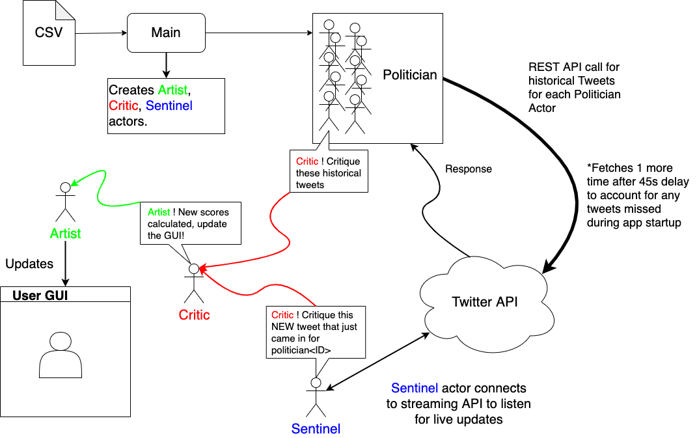

# CSCI795_ReactiveProg_Project
## Presentation for CSCI 795 Reactive Programming Course - Hunter College FA'20

## Dev Setup
### Pre-reqs
1. Sign up for a Twitter Dev Account (Takes 2-3 days for approval)
    1. This will give you the account level `<API_KEY>` and `<API_TOKEN>`
2. Create an app in your dev portal/account.
    1. Then generate an app level access token for the `<APP_ACCESS_TOKEN>` and `<APP_ACCESS_KEY>`
3. In the provided `secrets.csv` file in the project folder, fill in the necessary tokens that you generate in the previous steps.

### Run Instructions
1. Checkout this repo.
2. `cd` into the root of this project
3. Run `./sbt` to run the build tool.
4. Run `reStart` to run the application and hot restart the app after code changes.

- Notes: Current API streaming service only supports limited # of connections over a time interval. If you run into any 400/500 errors regarding connection threshold, simply stop the program and try again after a few minutes.

### Milestones
#### @y3pio (https://github.com/y3pio):
- [X] Set up Akka dev environment and setup instructions
  - [X] Import this library: https://github.com/DanielaSfregola/twitter4s
- [X] Connect to Twitter API
  - [X] Need to create DEV account and sign up
- [X] Get Akka stream to process live Tweet updates
  - [X] Need a dummy account, use the DEV account for this?

#### @recursion-ninja (https://github.com/recursion-ninja):
- [X] Get historical tweets, not just processing live ones that come in.
- [ ] ~~Figure out how to parse metadata of tweet both present/historical (flagged content - need to simulate this)~~
  - (This information is not available via the Twitter API)
- [X] Collect politician lists (who we are going to track)
- [X] Come up with scoring system and print to output

Stretch goal:
- [X] Create Akka stream to log and process further back into history
- [X] Create UI to show data (plots, graphs, other fancy UI stuff)

## Actor Diagram
 
